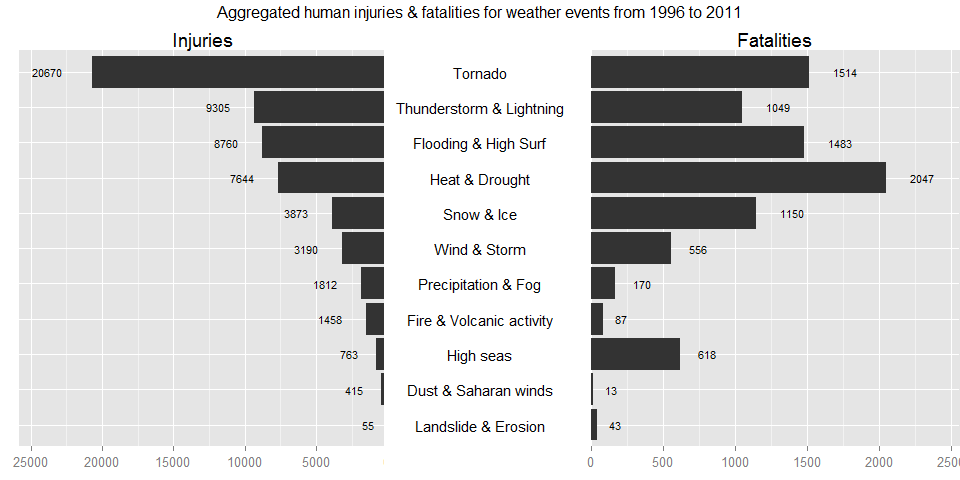
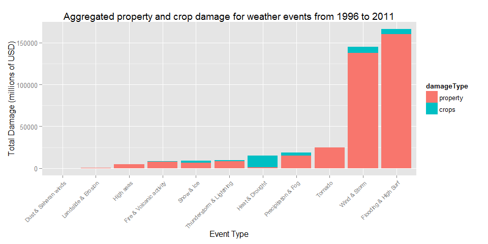

# Analysis of different weather events in the USA based on the NOAA Storm Database, and their impact in economic damage and Injuries and Fatalities
Timothy A. Grove  
September 22, 2015  

### 1. Synopsis
  
The National Oceanic and Atmospheric Administration (NOAA) maintains a public database for storm event. The data contains the type of storm event, details like location, date, estimates for damage to property as well as the number of human victims of the storm. In this report we investigate which type of events are the most harmful to the population and financially.  This analysis was completed using the open source analytic program R which can be downloaded from this <a href="https://www.r-project.org/">link</a>.

### 2. Data Processing

The data for this analysis comes in the form of a comma-separated-value file compressed via the bzip2 algorithm to reduce its size. You can download the file from the course web site:

<a href="https://d396qusza40orc.cloudfront.net/repdata%2Fdata%2FStormData.csv.bz2">Storm Data</a> [47Mb]

There is also some documentation of the database available. Here you will find how some of the variables are constructed/defined.

National Weather Service <a href="https://d396qusza40orc.cloudfront.net/repdata%2Fpeer2_doc%2Fpd01016005curr.pdf">Storm Data Documentation</a>

National Climatic Data Center Storm Events [<a href="https://d396qusza40orc.cloudfront.net/repdata%2Fpeer2_doc%2FNCDC%20Storm%20Events-FAQ%20Page.pdf">FAQ</a>]

The events in the database start in the year 1950 and end in November 2011. In the earlier years of the database there are generally fewer events recorded, most likely due to a lack of good records. More recent years should be considered more complete.

##### 2.1. Load libraries
There are many R libraries that are necessary to perform loading, computation, transformation and plotting of data


```r
library(RCurl) # for loading external dataset (getBinaryURL)
library(R.utils) # for bunzip2


library(plyr) # for count & aggregate method
library(dplyr) # for count & aggregate method
library(reshape2) # for melt 

library(ggplot2) # for plots
library(grid) # for grids
library(gridExtra) # for advanced plots
library(scales) # for plot scaling
```


##### 2.2. Load source file and extract it

In order to make the analysis faster to load and run, the results of the data process are stored in a .RData file. Ths allows us to go directly to plotting, by loading the RData when it is available. To rerun all processing, remove the .RData from your local "/data/"" folder.

* Set working directory (in this instance to my local GitHub folder for my Assignment)


```r
setwd("~/GitHub/RepData_PeerAssessment2")
```


* This section loads the specified source files from URL and storing it locally if not already stored
 

```r
dataProcess <- TRUE
# check if reducedStormData variable already exists
if(file.exists("./data/StormData.RData")){
  load("./data/StormData.RData")
  dataProcess <- FALSE
}

if(dataProcess){
  # create a data dir if it doesn't exist
  if(!file.exists("./data")){
      dir.create("./data")
  }
  # load file from URL to bz2 file in data dir
  if(!file.exists("./data/StormData.csv.bz2")){
    fileUrl <- "https://d396qusza40orc.cloudfront.net/repdata/data/StormData.csv.bz2"
    destPath <- "./data/StormData.csv.bz2"
    binData <- getBinaryURL(fileUrl, ssl.verifypeer=0L, followlocation=1L)
    destFileHandle <- file(destPath, open="wb")
    writeBin(binData,destFileHandle)
    close(destFileHandle)
    # Clear temporary items from memory
    rm(binData, fileUrl, destFileHandle)
  }
  # unzip bz2 file to csv
  if(!file.exists("./data/StormData.csv")){
    filePath <- "./data/StormData.csv.bz2"
    destPath <- "./data/StormData.csv"
    bunzip2(filePath,destPath,overwrite=TRUE, remove=FALSE)
    # Clear temporary items from memory
    rm(filePath, destPath)
  }
}
```


##### 2.3. Load the data

Read the source .csv file


```r
if(dataProcess){
  csvStormData <- read.csv("./data/StormData.csv")
}
```

##### 2.4. Remove unwanted colums (not used for this analysis)

There are many columns present inthe data which are not necessary for this analysis.  The full list of columns:


```r
names(csvStormData)
```

```
##  [1] "STATE__"    "BGN_DATE"   "BGN_TIME"   "TIME_ZONE"  "COUNTY"    
##  [6] "COUNTYNAME" "STATE"      "EVTYPE"     "BGN_RANGE"  "BGN_AZI"   
## [11] "BGN_LOCATI" "END_DATE"   "END_TIME"   "COUNTY_END" "COUNTYENDN"
## [16] "END_RANGE"  "END_AZI"    "END_LOCATI" "LENGTH"     "WIDTH"     
## [21] "F"          "MAG"        "FATALITIES" "INJURIES"   "PROPDMG"   
## [26] "PROPDMGEXP" "CROPDMG"    "CROPDMGEXP" "WFO"        "STATEOFFIC"
## [31] "ZONENAMES"  "LATITUDE"   "LONGITUDE"  "LATITUDE_E" "LONGITUDE_"
## [36] "REMARKS"    "REFNUM"
```

Just keep the columns:  
* BGN_DATE  
* EVTYPE  
* FATALITIES  
* INJURIES  
* PROPDMG  
* PROPDMGEXP  
* CROPDMG  
* CROPDMGEXP


```r
if(dataProcess){
  neededColumns <- c("BGN_DATE", "EVTYPE", "FATALITIES", "INJURIES", "PROPDMG", "PROPDMGEXP", "CROPDMG", "CROPDMGEXP")
  reducedStormData <- csvStormData[, neededColumns]
  reducedStormData <- rename(reducedStormData, c("FATALITIES"="fatalities", "INJURIES"="injuries"))

# Clear temporary items from memory
  rm(csvStormData,neededColumns)
}
```

##### 2.5. Refactor BGN_DATE, determine the offset year to use, and reduce the dataset

Since the later years account for more observations, results could be skewed by the first years.
By still using the majority of the observations, the cutoff point is arbritrarely set at 75% 


```r
if(dataProcess){
  # get some counts
  totalNumberOfObservations <- nrow(reducedStormData)
  cutOffPercentage = 0.75
  cutOffObservations = round(totalNumberOfObservations * cutOffPercentage)
  
  # add columns for date calculations based on BGN_DATEro
  reducedStormData$year = as.numeric(format(as.Date(reducedStormData$BGN_DATE, format = "%m/%d/%Y"), "%Y"))
  
  # create dataset with count per year, reverse the recordset, create running total 
  yearRecords <- count(reducedStormData, "year")
  yearRecords <- yearRecords[order(yearRecords$year, decreasing=TRUE), ]
  yearRecords$runningTotal = cumsum(yearRecords$freq)
  cutOffYear <- min(yearRecords[yearRecords$runningTotal < cutOffObservations, 1])
  
  # reduce the dataset
  reducedStormData <- reducedStormData[reducedStormData$year >= cutOffYear, ]
  endYear <- max(reducedStormData$year)
  
  # clean reducedStormData
  reducedStormData$BGN_DATE <- NULL
  rownames(reducedStormData) <- NULL
}
```

##### 2.6. Refactor EVTYPE into 11 levels

The EVTYPE column contains 516 unique source events. 


```r
if(dataProcess){
  EventCounts <- reducedStormData %>% summarise(Unique_Elements = n_distinct(EVTYPE))
}
  EventCounts
```

```
##   Unique_Elements
## 1             516
```

Many of them can be reduced to similar instances. In this instance there are 11 levels defined, covering effectifly the majority and all useful data records (summaries and combinations are skipped)


```r
if(dataProcess){
  reducedStormData$damageSource <- NA
  
  reducedStormData[
    grepl("precipitation|rain|hail|drizzle|wet|percip|burst|depression|fog|wall cloud", 
          reducedStormData$EVTYPE, 
          ignore.case = TRUE), 
    "damageSource"] <- "Precipitation & Fog"
  reducedStormData[
    grepl("wind|storm|wnd|hurricane|typhoon", 
          reducedStormData$EVTYPE, 
          ignore.case = TRUE), 
    "damageSource"] <- "Wind & Storm"
  reducedStormData[
    grepl("slide|erosion|slump", 
          reducedStormData$EVTYPE, 
          ignore.case = TRUE), 
    "damageSource"] <- "Landslide & Erosion"
  reducedStormData[
    grepl("warmth|warm|heat|dry|hot|drought|thermia|temperature record|record temperature|record high",
          reducedStormData$EVTYPE, 
          ignore.case = TRUE), 
    "damageSource"] <- "Heat & Drought"
  reducedStormData[
    grepl("cold|cool|ice|icy|frost|freeze|snow|winter|wintry|wintery|blizzard|chill|freezing|avalanche|glaze|sleet",
          reducedStormData$EVTYPE, 
          ignore.case = TRUE), 
    "damageSource"] <- "Snow & Ice"
  reducedStormData[
    grepl("flood|surf|blow-out|swells|fld|dam break", 
          reducedStormData$EVTYPE, 
          ignore.case = TRUE), 
    "damageSource"] <- "Flooding & High Surf"
  reducedStormData[
    grepl("seas|high water|tide|tsunami|wave|current|marine|drowning", 
          reducedStormData$EVTYPE, 
          ignore.case = TRUE), 
    "damageSource"] <- "High seas"
  reducedStormData[
    grepl("dust|saharan", 
          reducedStormData$EVTYPE, 
          ignore.case = TRUE), 
    "damageSource"] <- "Dust & Saharan winds"  
  reducedStormData[
    grepl("tstm|thunderstorm|lightning", 
          reducedStormData$EVTYPE, 
          ignore.case = TRUE), 
    "damageSource"] <- "Thunderstorm & Lightning"
  reducedStormData[
    grepl("tornado|spout|funnel|whirlwind", 
          reducedStormData$EVTYPE, 
          ignore.case = TRUE), 
    "damageSource"] <- "Tornado"
  reducedStormData[
    grepl("fire|smoke|volcanic", 
          reducedStormData$EVTYPE, 
          ignore.case = TRUE), 
    "damageSource"] <- "Fire & Volcanic activity"
  
  # remove uncategorized records (damageSource == NA) & cast as factor
  reducedStormData <- reducedStormData[complete.cases(reducedStormData[, "damageSource"]), ]
  reducedStormData$damageSource <- as.factor(reducedStormData$damageSource)
  
  # clean reducedStormData
  reducedStormData$EVTYPE <- NULL
}
```

##### 2.7. Refactor PROPDMG, CROPDMG, PROPDMGEXP & CROPDMGEXP to absolute damage values

Format the DMG and DMGEXP fields in absolute values. Undefined EXP properties, like +, ?, make the record NA


```r
if(dataProcess){
  # function to convert symbol to a power of 10 (for use with PROPDMGEXP & CROPDMGEXP)
  toTenPower <- function(x){
    if(is.numeric(x)) {
      x <- x
    }
    else if(grepl("h", x, ignore.case=TRUE)) {
      x <- 2
    }
    else if(grepl("k", x, ignore.case=TRUE)) {
      x <- 3
    }
    else if(grepl("m", x, ignore.case=TRUE)) {
      x <- 6
    }
    else if(grepl("b", x, ignore.case=TRUE)) {
      x <- 9
    }
    else if(x == "" || x == " "){
      x <- 0
    }
    else{
      x <- NA
    }
    x
  }
   
  # function to take two parameters num and exp and convert it to one absolute value. non integers become 0
  calculateAmount <- function(num, exp){
    pow <- toTenPower(exp)
    if(is.numeric(num)){
      num <- num * (10 ^ pow)
    }
    
    if(!is.numeric(num)){
      num <- 0
    }
    
    num
  }
  
  # create 2 new fields for calculated propDamage & cropDamage and add them to one damageTotal field
  reducedStormData$propDamage <- mapply(calculateAmount, reducedStormData$PROPDMG, reducedStormData$PROPDMGEXP)
  reducedStormData$cropDamage <- mapply(calculateAmount, reducedStormData$CROPDMG, reducedStormData$CROPDMGEXP)
  reducedStormData$damageTotal = reducedStormData$propDamage + reducedStormData$cropDamage
  
  # clean reducedStormData
  reducedStormData$PROPDMG <- NULL
  reducedStormData$PROPDMGEXP <- NULL
  reducedStormData$CROPDMG <- NULL
  reducedStormData$CROPDMGEXP <- NULL
}
```

##### 2.8. Create aggregated datasets and variables for plots

The final data frames must be recast to be used in certain plot funtions


```r
if(dataProcess){
  # aggregate economic damage per damageSource
  sumEconomicDamage <- aggregate(formula=cbind(propDamage, cropDamage, damageTotal) ~ damageSource, data=reducedStormData, FUN=sum, na.rm=TRUE)
  sumEconomicDamage <- sumEconomicDamage[order(sumEconomicDamage$damageTotal, decreasing=TRUE),]
  rownames(sumEconomicDamage) <- NULL
  sumEconomicDamage$damageSource <- factor(sumEconomicDamage$damageSource, levels=rev(sumEconomicDamage$damageSource))
  
  # melt the sumEconomicDamage into data frame to be used as bar chart
  meltSumEconomicDamage <- melt(sumEconomicDamage, id.vars=c("damageSource"), measure.vars=c("propDamage","cropDamage"), variable.name="damageType", value.name="damage")
  levels(meltSumEconomicDamage$damageType)[levels(meltSumEconomicDamage$damageType)=="propDamage"] <- "property"
   levels(meltSumEconomicDamage$damageType)[levels(meltSumEconomicDamage$damageType)=="cropDamage"] <- "crops"
  
  # aggregate humanitarian damage per damageSource
  sumHumanDamage <-aggregate(formula=cbind(injuries, fatalities) ~ damageSource, data=reducedStormData, FUN=sum, na.rm=TRUE) 
  sumHumanDamage <- sumHumanDamage[order(sumHumanDamage$injuries, decreasing=TRUE),]
  rownames(sumHumanDamage) <- NULL
  sumHumanDamage$damageSource <- factor(sumHumanDamage$damageSource, levels=rev(sumHumanDamage$damageSource))
  
  # define max values for bar chart scale
  maxInjuries <- max(sumHumanDamage$injuries)
  maxInjuries <- maxInjuries + round(maxInjuries * 0.25)
 
  maxFatalities <- max(sumHumanDamage$fatalities)
  maxFatalities <- maxFatalities + round(maxFatalities * 0.25)  
}
```

##### 2.10. Save reducedStormData et al to RData file 

Save the processed data to an RData file (see 2.2)


```r
if(dataProcess){
  save(reducedStormData, 
       sumHumanDamage, 
       meltSumEconomicDamage,
       sumEconomicDamage, 
       maxInjuries, 
       maxFatalities,
       cutOffYear,
       endYear,
       EventCounts,
       file="./data/StormData.RData")
}
```


### 3. Results

##### 3.1. Show the first & last 5 lines of the new data set

Display a few records of the cleaned, reformatted stormData to be used for analysis


```r
head(reducedStormData, n=5L)
```

```
##   fatalities injuries year             damageSource propDamage cropDamage
## 1          0        0 1996               Snow & Ice     380000      38000
## 2          0        0 1996                  Tornado     100000          0
## 3          0        0 1996 Thunderstorm & Lightning       3000          0
## 4          0        0 1996 Thunderstorm & Lightning       5000          0
## 5          0        0 1996 Thunderstorm & Lightning       2000          0
##   damageTotal
## 1      418000
## 2      100000
## 3        3000
## 4        5000
## 5        2000
```

```r
tail(reducedStormData, n=5L)
```

```
##        fatalities injuries year damageSource propDamage cropDamage
## 653526          0        0 2011 Wind & Storm          0          0
## 653527          0        0 2011 Wind & Storm          0          0
## 653528          0        0 2011 Wind & Storm          0          0
## 653529          0        0 2011   Snow & Ice          0          0
## 653530          0        0 2011   Snow & Ice          0          0
##        damageTotal
## 653526           0
## 653527           0
## 653528           0
## 653529           0
## 653530           0
```

##### 3.2. Injuries vs. Fatalities

This graph shows the injuries and fatalaties for each major weather event, orderd by number of injuries.

You can see that the top 5 for both contain the same events. 

Heat & Drought has more fatalities and less injuries than Tornado's.  But combined injuries and fatalities, Tornado's are the clearly the event that kills or injures the most people.


```r
# add middle column with just damageSource labels
g.mid <- ggplot(data=sumHumanDamage, aes(x=1,y=damageSource)) +
            geom_text(aes(label=damageSource), size=4) +
            ggtitle("") +
            ylab(NULL) +
            scale_x_continuous(expand=c(0,0),limits=c(0.94,1.065)) +
            theme(axis.title=element_blank(),
                  panel.grid=element_blank(),
                  axis.text.y=element_blank(),
                  axis.ticks.y=element_blank(),
                  panel.background=element_blank(),
                  axis.text.x=element_text(color=NA),
                  axis.ticks.x=element_line(color=NA),
                  plot.margin = unit(c(1,-1,1,-1), "mm"))

# add left chart with injuries
g.injuries <- ggplot(data=sumHumanDamage, aes(x=damageSource, y=injuries)) +
            geom_bar(stat = "identity") + 
            geom_text(aes(label=injuries), size=3, vjust=0.5, hjust=2.0) +
            ggtitle("Injuries") +
            scale_y_reverse(expand=c(0, 0), limits=c(maxInjuries,0)) + 
            coord_flip() +
            theme(axis.title.x = element_blank(), 
                  axis.title.y = element_blank(), 
                  axis.text.y = element_blank(), 
                  axis.ticks.y = element_blank(), 
                  plot.margin = unit(c(1,-1,1,0), "mm")) 

# add right chart with fatalities
g.fatalities <- ggplot(data=sumHumanDamage, aes(x=damageSource, y=fatalities)) +
            geom_bar(stat = "identity") + 
            geom_text(aes(label=fatalities), size=3, vjust=0.5, hjust=-1.0) +
            ggtitle("Fatalities") +
            scale_y_continuous(expand=c(0, 0), limits=c(0,maxFatalities)) + 
            coord_flip() +
            theme(axis.title.x = element_blank(), 
                  axis.title.y = element_blank(), 
                  axis.text.y = element_blank(), 
                  axis.ticks.y = element_blank(), 
                  plot.margin = unit(c(1,0,1,-1), "mm")) 

# combine charts in one plot
gg.injuries <- ggplot_gtable(ggplot_build(g.injuries))
gg.fatalities <- ggplot_gtable(ggplot_build(g.fatalities))
gg.mid <- ggplot_gtable(ggplot_build(g.mid))

grid.arrange(gg.injuries,gg.mid,gg.fatalities,
             ncol=3,widths=c(4/10,2/10,4/10),
             #main=paste("Aggregated human injuries & fatalities for weather events from ",cutOffYear," to ",endYear, sep="")
             top=paste("Aggregated human injuries & fatalities for weather events from ",cutOffYear," to ",endYear, sep="")
             )
```

 

The underlying data

```r
sumHumanDamage
```

```
##                damageSource injuries fatalities
## 1                   Tornado    20670       1514
## 2  Thunderstorm & Lightning     9305       1049
## 3      Flooding & High Surf     8760       1483
## 4            Heat & Drought     7644       2047
## 5                Snow & Ice     3873       1150
## 6              Wind & Storm     3190        556
## 7       Precipitation & Fog     1812        170
## 8  Fire & Volcanic activity     1458         87
## 9                 High seas      763        618
## 10     Dust & Saharan winds      415         13
## 11      Landslide & Erosion       55         43
```

##### 3.3. Economic Damage

Crop damage is hardly a factor in comparission to the total economic cost of certain weather events, wiht the exception of Heat & Drought, where it effects more than 90%

The Wind & Storm and Flooding & High Surf groupings comprise more than 80% of all economic damage over the years included in the analysis.

Tornado's,Thunderstorms and Snow & Ice, which have high impact in injuries and fatalities, are a distant 3rd in economic damage impact.


```r
ggplot(meltSumEconomicDamage, aes(x=damageSource, y=damage/1000000)) + 
  geom_bar(stat = "identity", aes(fill=damageType)) +
  xlab("Event Type") +
  theme(axis.text.x = element_text(angle = 45, size=8, hjust = 1, vjust = 1)) +
  ylab("Total Damage (millions of USD)") +
  ggtitle(paste("Aggregated property and crop damage for weather events from ",cutOffYear," to ",endYear, sep=""))
```

 

The underlying data

```r
sumEconomicDamage
```

```
##                damageSource   propDamage  cropDamage  damageTotal
## 1      Flooding & High Surf 159875724170  6349563200 166225287370
## 2              Wind & Storm 137984324660  6726848600 144711173260
## 3                   Tornado  24622829010   283425010  24906254020
## 4       Precipitation & Fog  15203426360  3225242250  18428668610
## 5            Heat & Drought   1057077300 13860159500  14917236800
## 6  Thunderstorm & Lightning   8662530360  1023891040   9686421400
## 7                Snow & Ice   6467844450  2816170100   9284014550
## 8  Fire & Volcanic activity   7761049500   402255130   8163304630
## 9                 High seas   4798122340    41022500   4839144840
## 10      Landslide & Erosion    327494100    20017000    347511100
## 11     Dust & Saharan winds      6157630     3100000      9257630
```

### 4. Conclusions

The impact on humans, in terms of injuries or fatalities isn't directly correlated to the ecomomic damage weather events cause. 

Tornado's are by far the highest cause for injuries (20670), and second in fatalities (1514), and are the top cause of harm (both injuries and fatalities, at 22184) when combined.  

Thunderstorms are second in injuries (9305) and fifth in fatalities (1049) is the second largest cause of harm when combined (10354).

Flooding & High surf, which is third in both categories (Injuries: 8760, Fatalities: 1483) is a very close third in combined harm (10243)

Heat & drought cause the most fatalities (2047), but far fewer injuries (7644) and are fourth overall when combined (9691). 

In economic damages, only the property damage really factors in the total damage, except for Heat & Drought where more than 90% of damages is determined by crop damage. 

The #1 & #2 of weather damage sources; Flooding & High Surf and Wind & Storm; cover more than 80% of all economic cost, while Wind & Storm aren't even in the top 5 of harm to people.


### 5. Reproducible Research - Peer Assessment 2

This assessment and analysis was performed as an assignment for the Coursera <a href="https://www.coursera.org/course/repdata">Reproducible Research</a> course.  The assignment parameters are listed in the following points.

##### 5.1. Introduction to assignment

Storms and other severe weather events can cause both public health and economic problems for communities and municipalities. Many severe events can result in fatalities, injuries, and property damage, and preventing such outcomes to the extent possible is a key concern.

This project involves exploring the U.S. National Oceanic and Atmospheric Administration's (NOAA) storm database. This database tracks characteristics of major storms and weather events in the United States, including when and where they occur, as well as estimates of any fatalities, injuries, and property damage.

##### 5.2. Goals of assignment

The basic goal of this assignment is to explore the NOAA Storm Database and answer some basic questions about severe weather events. You must use the database to answer the questions below and show the code for your entire analysis. Your analysis can consist of tables, figures, or other summaries. You may use any R package you want to support your analysis.

##### 5.3. Questions to address


1. Across the United States, which types of events (as indicated in the EVTYPE variable) are most harmful with respect to population health?

2. Across the United States, which types of events have the greatest economic consequences?

##### 5.4. Requirements

For this assignment you will need some specific tools  

* RStudio: You will need RStudio to publish your completed analysis document to RPubs. You can also use RStudio to edit/write your analysis.  

* knitr: You will need the knitr package in order to compile your R Markdown document and convert it to HTML  

##### 5.5. Document Layout

* Language: Your document should be written in English.  
* Title: Your document should have a title that **briefly** summarizes your data analysis  
* Synopsis: Immediately after the title, there should be a **synopsis** which describes and summarizes your analysis in at most 10 complete sentences.  
* There should be a section titled **Data Processing** which describes (in words and code) how the data were loaded into R and processed for analysis. In particular, your analysis must start from the raw CSV file containing the data. You cannot do any preprocessing outside the document. If preprocessing is time-consuming you may consider using the cache = TRUE option for certain code chunks.  
* There should be a section titled **Results** in which your results are presented.  
* You may have other sections in your analysis, but Data Processing and Results are **required**.  
* The analysis document must have **at least one figure containing a plot**.  
* Your analyis must have **no more than three figures**. Figures may have multiple plots in them (i.e. panel plots), but there cannot be more than three figures total.  
* You must show all your code for the work in your analysis document. This may make the document a bit verbose, but that is okay. In general, you should ensure that echo = TRUE for every code chunk (this is the default setting in knitr).  

##### 5.6. Publishing your Analysis

Publishing Your Analysis

For this assignment you will need to publish your analysis on RPubs.com. If you do not already have an account, then you will have to create a new account. After you have completed writing your analysis in RStudio, you can publish it to RPubs by doing the following:

In RStudio, make sure your R Markdown document (.Rmd) document is loaded in the editor

Click the Knit HTML button in the doc toolbar to preview your document.

In the preview window, click the Publish button.

Once your document is published to RPubs, you should get a unique URL to that document. Make a note of this URL as you will need it to submit your assignment.

**NOTE:** If you are having trouble connecting with RPubs due to proxy-related or other issues, you can upload your final analysis document file as a PDF to Coursera instead.


##### 5.7. Submitting Your Assignment

In order to submit this assignment, you must copy the RPubs URL for your completed data analysis document in to the peer assessment question.


### 6. Acknowledgements and Methods

In preparing for this assignment, I googled many previous students' work that is published.  There were many approaches, and after analyzing them all, I went with the approach that <a href="http://www.rpubs.com/tomlous/stormDataAnalysis">Tom Lous</a> used, as it gave a better aggregate picture of the impacts than most other analses, which did not factor similar types into the ranking of impact.  

The large number of event types in the data that are similar to other event types, deserved its own analysis and determination of whether the types could be combioned into a smaller number of categories.  Tom's analysis did this, so I followed his code.

Since the goal of this class is to be able to produce reproducible research, using code from others is reproducing research.  As a side note, in my job I use google much of the time to scour others' code, documentation, examples, training sites, blogs, etc. to determine how to produce results in the quickest and most accurate means that I can.

While much of this code is duplicated from Tom's published analysis, in regards to naming and usage of sets and plots, each section was run and analyzed individually to ensure correct results.  Some sections needed to be modified in order for the code to run on newer versions of the R packages being used to perform the analysis.  Additional code was included to clarity dataset content and illustrate why sections of code were necessary.
